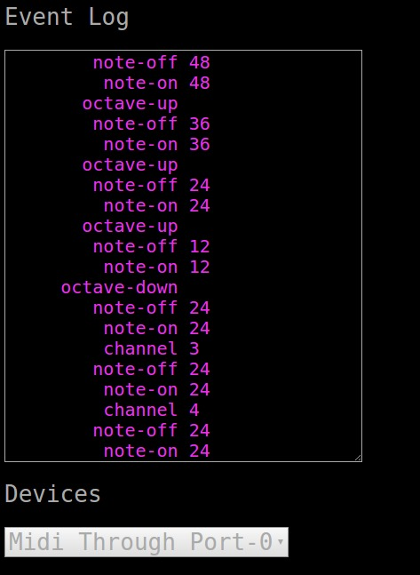

# WebMIDI Isomorphic Keyboard
Turn your computer keyboard into a MIDI keyboard.

## Usage
* Open index.html in your browser(Google Chrome is the only [current] browser with WebMIDI)
* Select the MIDI output device (one is already selected by default).
* Press letter or number keys and MIDI notes will be triggered.
* Press left or right arrow keys the MIDI channel down or up respectively.
* Press down or up arrow keys to adjust adjust the octave down or up respectively
* Press backspace/delete to turn off all midi notes (useful if notes get stuck).
* Press page down/up to decrement/increment the current patch (send a program change).
* Recently triggered events are displayed in the Event Log.

## Note Layout
* All the ascii letters and numbers represent pitches.
* The midi pitches are arranged uniformly (similar to a guitar tuned in minor 3rds)

## Screenshot

