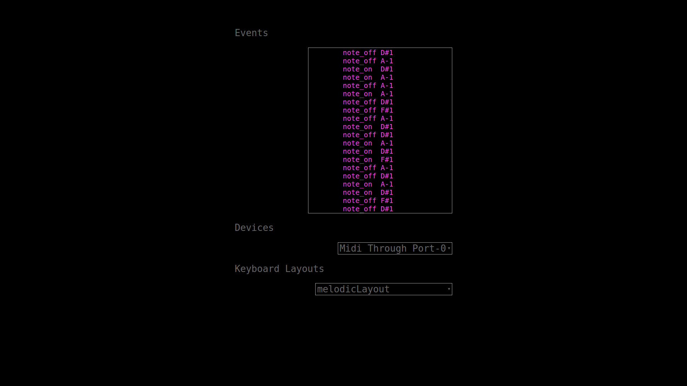

# WebMIDI Keyboard
Turn your computer keyboard into a MIDI keyboard.

## Usage
* Open index.html in your browser(Google Chrome is the only [current] browser with WebMIDI)
* Select the MIDI output device (one is already selected by default).
* Select which note layout you'd like (one is already selected by default).
* Recently triggered events are displayed in the Event Log.

## Keybindings
```
    letter/numbers       => MIDI note on/off
    down/up              => octave down/up
    left/right           => semitone down/up
    ctrl-down/ctrl-up    => keyboard layout down/up
    ctrl-left/ctrl-right => MIDI channel down/up
    page down/up         => MIDI program-change prior/next
    backspace/delete     => turn off all notes (if notes get stuck)
```
## Screenshot


